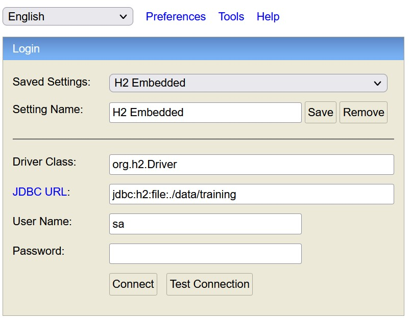
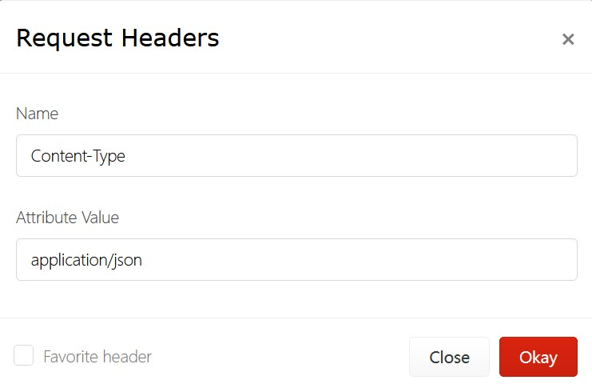
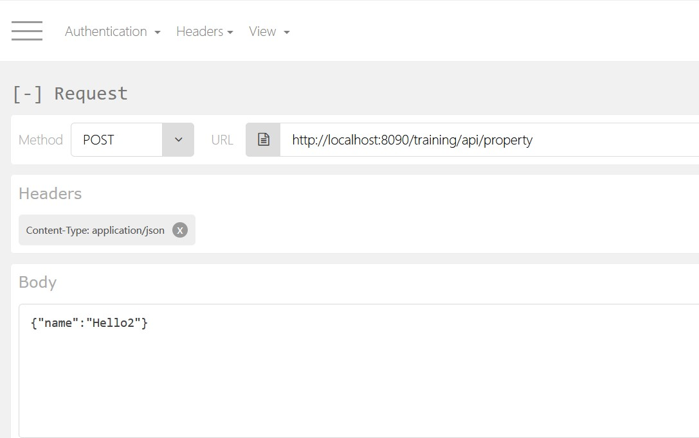
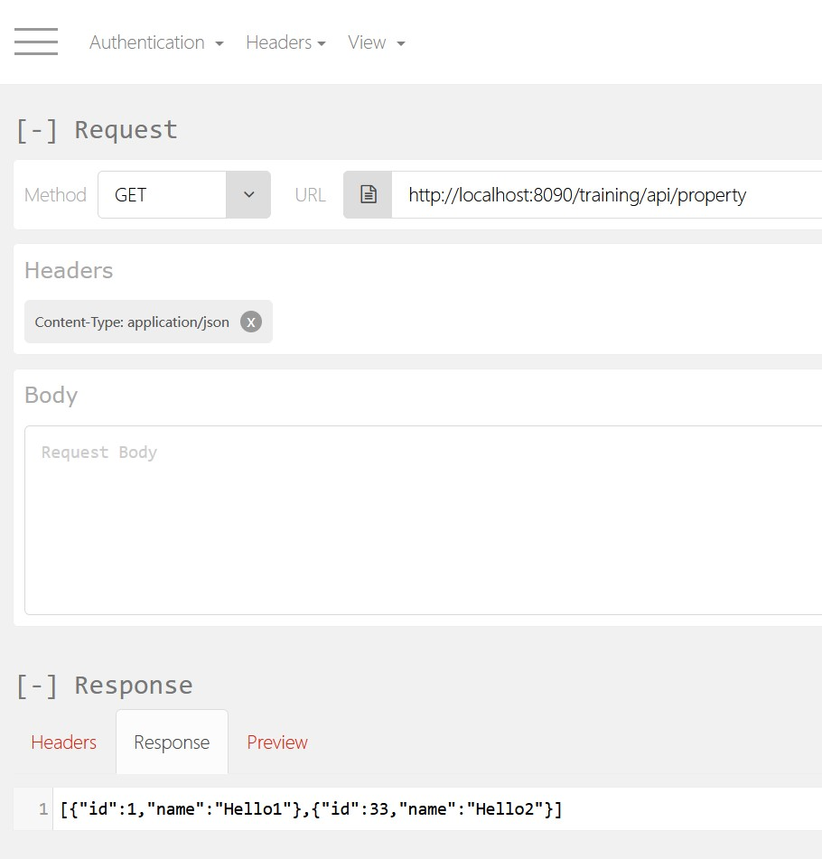

# Training Spring 1

## Architecture Overview / Prerequisites

Java - Download and install the latest JDK: <https://www.oracle.com/java/technologies/downloads>  
Maven - Download and install the latest Maven: <https://maven.apache.org/download.cgi?.>  
Eclipse - Download and install the latest Eclipse: <https://www.eclipse.org/downloads/>  
RESTClient - Download and install RESTful client in FireFox: <https://addons.mozilla.org/en-US/firefox/addon/restclient>

In the example that I’m detailing below, we used Spring Boot 2.6.7 RELEASE version.

## Import into Eclipse and run

Import this project into Eclipse and run Maven: clean package spring-boot:run

## H2 Console

Local URL: <http://localhost:8090/training/h2-console>  

JDBC URL: jdbc:h2:file:./data/training

  

## RESTClient

Add header for JSON - In the top menu is dropdown for "Headers"  Choose "Custom Header":

  

#### Post data:  

URL: http://localhost:8090/training/api/property

  

#### Get data:  

URL: http://localhost:8090/training/api/property

  

